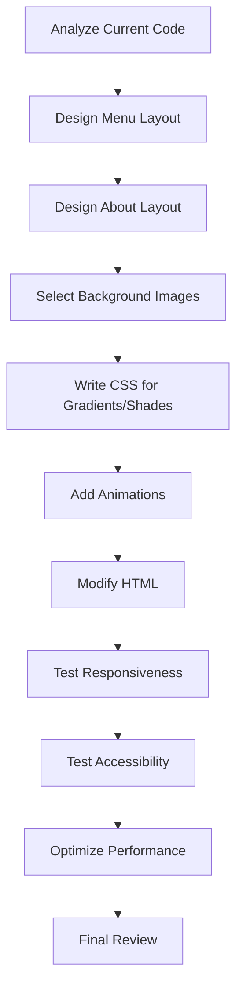

# Restaurant Page Styling Improvement Plan

## Overview

This plan outlines improvements to the Menu and About components with modern, responsive design elements including gradients, shadows, and animations. The goal is to make the menu intuitive and accessible, and the about section engaging and informative. High-quality background images will be integrated, optimized for performance.

## Current State Analysis

- **Menu Component**: Simple list structure with sections (Appetizers, Main Courses, Desserts) and items displaying name, description, and price.
- **About Component**: Basic text content with title and two paragraphs.
- **Styling**: Minimal CSS with basic layout, colors from design system (charcoal, white, olive green, gold).

## Proposed Improvements

### Menu Component

- **Layout Enhancements**:

  - Add card-like design for menu items with rounded corners, shadows, and hover effects.
  - Use flexbox/grid for better alignment and spacing.
  - Add subtle gradients for section headers.

- **Animations**:

  - Fade-in animations for menu sections on load.
  - Hover animations for menu items (scale, shadow increase).
  - Staggered animation for menu items.

- **Accessibility**:

  - Ensure keyboard navigation.
  - Add ARIA labels for menu sections.
  - High contrast for prices.

- **Responsiveness**:
  - Stack items vertically on mobile.
  - Adjust font sizes and padding for smaller screens.

### About Component

- **Layout Enhancements**:

  - Add a hero-like section with background image.
  - Use typography hierarchy with larger fonts and spacing.
  - Add icons or decorative elements.

- **Animations**:

  - Typewriter effect for the story text.
  - Parallax scrolling for background image.

- **Engagement**:

  - Add call-to-action button.
  - Include team photos or quotes.

- **Accessibility**:

  - Semantic HTML structure.
  - Alt text for images.

- **Responsiveness**:
  - Center content with max-width.
  - Adjust text size and spacing on mobile.

### Background Images

- **Selection**:

  - Menu: Use gallery1.jpg (food-related) as background.
  - About: Use gallery2.jpg or hero.jpg for storytelling.

- **Integration**:

  - Use CSS background-image with cover sizing.
  - Add overlay for text readability.
  - Lazy loading for performance.

- **Optimization**:
  - Compress images (WebP format).
  - Use responsive images with srcset.
  - Preload critical images.

### Technical Specifications

#### CSS Changes

- **Gradients**: Linear gradients for headers (e.g., `background: linear-gradient(45deg, var(--accent-color), var(--secondary-accent-color));`).
- **Shadows**: Box-shadow for cards (e.g., `box-shadow: 0 4px 8px rgba(0,0,0,0.1);`).
- **Animations**: Keyframes for fade-in, hover effects.
- **Responsive**: Media queries for breakpoints (768px, 480px).

#### HTML Modifications

- **Menu**: Add wrapper divs for sections, add data attributes for animations.
- **About**: Add image elements, CTA button.
- **Classes**: Add classes like `.menu-card`, `.about-hero`.

#### Performance Considerations

- **Images**: Use modern formats (WebP), lazy loading with Intersection Observer.
- **CSS**: Minimize repaints with transform animations.
- **Bundle**: Ensure CSS is minified.

### Implementation Steps

1. Update CSS for gradients and shadows.
2. Add animations to menu items.
3. Integrate background images.
4. Modify HTML structure.
5. Add responsiveness.
6. Enhance accessibility.
7. Optimize performance.

### Mermaid Diagram for Workflow

## Conclusion

This plan provides a comprehensive approach to modernizing the Menu and About sections. Implementation should follow the steps outlined, with testing at each stage.
